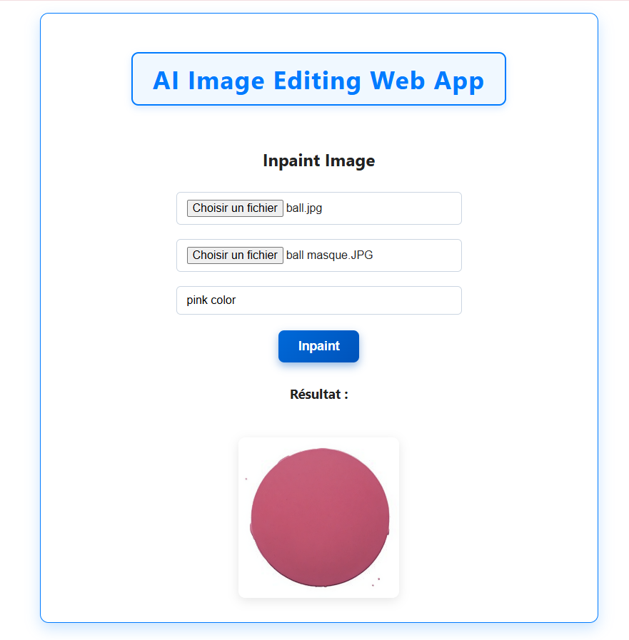

# 🖼️ AI Image Editing Web App 🎨🤖

This is a full-stack web application that allows users to generate and edit images using **Stability AI's image generation APIs**.  
It currently supports:

- ✅ **Inpainting**: Edit specific parts of an image using a mask and a text prompt
## 📸 Example Result

Below is an example where the color of a ball was changed from red to pink using the Inpainting feature:

## ⚙️ Backend Setup
cd backend
python -m venv venv
venv\Scripts\activate  
pip install -r requirements.txt
# Ajoute ta clé API dans .env
STABILITY_API_KEY=sk-NOv5v2IfXXUAjou2EmjUmQmScn4juhxTZoux8swbNvVUh7M1
# Lancer le serveur Flask
python app.py
## 🌐 Frontend Setup
cd ../frontend
npm install
npm start
## How It Works
The user uploads an image and a mask.
Enters a text prompt
The app sends the data to the backend, which calls the Stability AI Inpainting API.
The resulting image is returned and displayed on the page.
